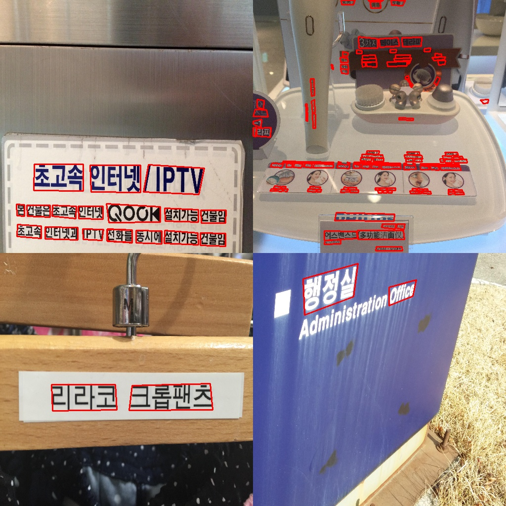
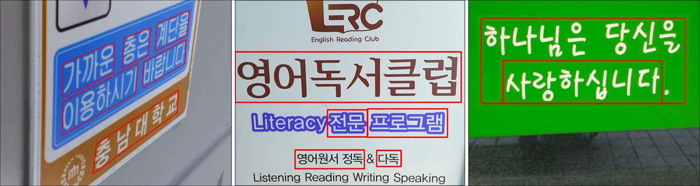
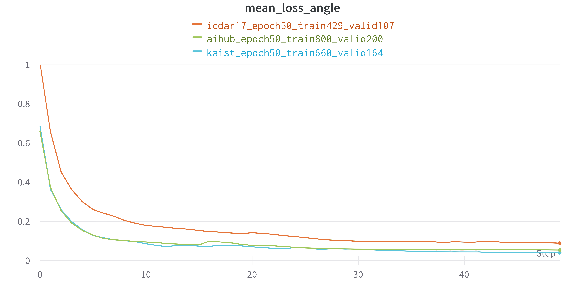
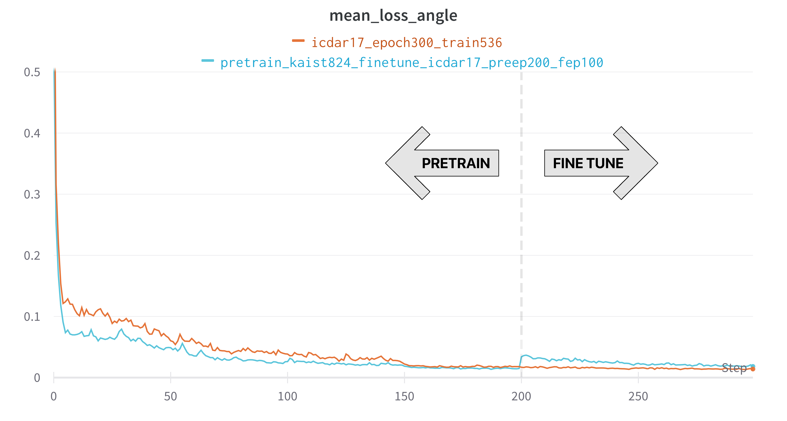

# CV 데이터 제작 Wrapup Report

# 1. 프로젝트 개요

스마트폰으로 카드를 결제하거나, 카메라로 카드를 인식할 경우 자동으로 카드 번호가 입력되는 경우가 있습니다. 또 주차장에 들어가면 차량 번호가 자동으로 인식되는 경우도 흔히 있습니다. 이처럼 OCR (Optimal Character Recognition) 기술은 사람이 직접 쓰거나 이미지 속에 있는 문자를 얻은 다음 이를 컴퓨터가 인식할 수 있도록 하는 기술로, 컴퓨터 비전 분야에서 현재 널리 쓰이는 대표적인 기술 중 하나입니다.

OCR task는 글자 검출 (text detection), 글자 인식 (text recognition), 정렬기 (Serializer) 등의 모듈로 이루어져 있습니다. 본 대회는 아래와 같은 특징과 제약 사항이 있습니다.

**본 대회에서는 '글자 검출' task 만을 해결하게 됩니다.**

# 2. 프로젝트 팀 구성 및 역할

김동영: EDA, data formatting

김형훈: utils 개발, under/overfitting, fine-tunning

송영동:  UFO format converter, mosaic data augmentation

정상헌: 팀원들이 만들어준 다양한 utils를 응용해 다양한 데이터셋 적용 실험

최휘준: augmentation

# 3. 프로젝트 수행 과정 및 결과

## Ⅰ. 실험

## 1) Optimizer & Scheduler

### ① 가설

현재 train 시 200epoch 가까이 돌려야 할 정도로 수렴 속도가 낮음.

최적의 optimizer와 scheduler를 찾아서 수렴 속도를 더 빠르게 하여 신속한 실험을 할 수 있을 것으로 예상

---

### ② 실험 설계

| index | optimizer | scheduler | 100 epoch loss | optimizer parameter | scheduler parameter | 특이사항 |
| --- | --- | --- | --- | --- | --- | --- |
| base | Adam | MultiStepLR | 0.8033 | lr=1e-3 | milestones=[50], gamma=0.1 |  |
| 1 | AdamW | RLROP | 0.7364 | lr=1e-3 | patience=10 |  |
| 2 | AdamW | RLROP | 0.7079 | lr=1e-4 | patience=10 |  |
| 3 | AdamW | RLROP | 1.072 | lr=1e-3 | patience=5, threshold=0.05 |  |
| 4 | AdamW | CosineAnnealingWarmUpRestarts | 0.9523 | lr=1e-6 | T_0=30, eta_max=1e-2, T_up=10, gamma=0.7 | https://gaussian37.github.io/dl-pytorch-lr_scheduler/#custom-cosineannealingwarmrestarts-1 |
| 5 | Adam | StepLR | 0.9915 | lr=1e-3 | step_size=10, gamma=0.33 |  |
| 6 | Adam | CosineAnnealingLR | 0.842 | lr=1e-3 | T_max=50, eta_min=0 |  |
| 7 | Adam | CosineAnnealingWarmRestarts | 0.8834 | lr=1e-3 | T_0=10, T_mult=2, eta_min=0 |  |
| 8 | Adam | CosineAnnealingWarmRestarts | 0.73754 | lr=1e-3 | T_0=10, T_mult=2, eta_min=0.00003 |  |
| 9 | Adam | CosineAnnealingWarmUpRestarts |  | lr=5e-5 | T_0=20, T_mult=1, eta_max=0.1, T_up=2, gamma=0.1 |  |

---

### ③ 실험 결과

비교를 위한 base : Adam_MultiStepLR
우리가 찾은 최적의 조합 : AdamW_CosineAnnealingWarmRestarts
100 epoch 만으로 비교한 결과 최적화 속도도 더 빠르고 loss를 더 감소시킬 수 있는 가능성을 볼 수 있는 실험

 AdamW의 적합한 lr을 찾기 위한 실험 (변인 : lr)
- 작은 lr에서 더 빠른 최적화 속도를 보여준다.
- ReduceLROnPlateau Scheduler를 썼지만, patience=10을 달성하지 않아서 lr에 변화는 없었다.

변인 : CosineAnnealingLR 에서 lr의 최솟값 
0 vs 3e-5 
lr의 최솟값을 3e-5으로 설정했을 때 최적화가 더 빠르다.

---

### ④ 결과 분석

- Optimizer
    - 기본 Adam 보다 AdamW 가 더 안정적인 성능을 보임
    - Adam optimizer 류의 lr은 정말 작아도 됨. 작은게 오히려 수렴도 빠르고 안정적임. (ex. 1e-4 정도, 1e-4 > 1e-3)
- Scheduler
    - CosineAnnealingRestart 의 성능이 좋았음
        - 다만, 한 주기를 좀 길게 볼수있게 해줘야함 (이번 실험에선 T=40 이 좋았음)
        - 그리고 마지막 epoch 시에 lr이 최소치에 수렴해야 함
    - local minima 에 빠지려고 할 때 탈출시켜주는 효과가 있음
- CosineAnnealingRestart 최솟값 설정 실험
    - lr값이 0.00003 보다 작아지면 loss값이 오히려 증가한다. → local minima에 빠지면서 최적의 가중치 조합을 찾기 어려워하는 것 같다.

---

## 2) Augmentation

## [실험1]

### ① 가설

aihub 야외 한글 데이터로만 학습시킨 후 제출하면 성능이 매우 낮게 나오는데, 그 이유는 데이터셋에 회전값이 없는 직사각형 bbox만 있고 rotated bbox는 없기 때문에 test dataset에 조금이라도 회전된 bbox가 있다면 잡아내지 못하기 때문일 것이다. 회전값이 없는 bbox 로만 이루어진 데이터셋으로 학습하더라도 rotate augmentation 을 주면 test dataset에 대한 성능이 좋아질 것이다.

---

### ② 실험 설계

|  | dataset | epoch | rotate (조작변인) |
| --- | --- | --- | --- |
| vanilla | 간판_실내안내판_030000 ~ 03999 총 1000장 | 50 | - |
| rotate 60 | 간판_실내안내판_030000 ~ 03999 총 1000장 | 50 | 60° |

---

### ③ 실험 결과

|  | 제출 f1 | 제출 recall | 제출 precision |
| --- | --- | --- | --- |
| vanilla | 0.0801  | 0.0603  | 0.1196 |
| rotate 60 | 0.0893  | 0.0863  | 0.0926 |

---

### ④ 결과 분석

좌: ICDAR17_MLT(회전 있음), 우: aihub 야외 한글 데이터셋(회전 없음)

- 회전 augmentation 을 주었을 때 성능이 더 높은 것으로 보아 test dataset 에도 ICDAR17_MLT 같이 rotated bbox 가 있음을 알 수 있다.
- ICDAR17_MLT로 동일한 epoch만큼 학습시키면 제출 f1이 0.2500 정도가 나온 것으로 보아 aihub 야외 한글 데이터셋으로 학습했을때의 낮은 제출 성적은 회전 augmentation 만의 부제는 아닌 것으로 보인다.

---

---

## [실험2]

### ① 가설

aihub 야외 한글 데이터셋에서 rotate augmentation이 효과가 있었듯이 ICDAR17_MLT 데이터셋에도 rotate augmentation이 효과가 있을 것이다. 또한 bbox는 조작하지 않는 pixel-level augmentation을 주면 일반화 성능이 향상되어 test dataset에 대한 성능도 좋아질 것이다.

---

### ② 실험 설계

|  | dataset | epoch | pixel augmentation (조작변인) | rotate (조작변인) |
| --- | --- | --- | --- | --- |
| vanilla | ICDAR_17 총 536장 | 50 | - | - |
| pixel augment | ICDAR_17 총 536장 | 50 | O | - |
| pixel augment + rotate 30 | ICDAR_17 총 536장 | 50 | O | 30° |
- ICDAR17_MLT는 aihub 야외 한글 데이터와 다르게 rotated bbox이기 때문에 rotate 값은 실험1의 60° 에서 30° 로 낮추었다.
- pixel augment: RandomBrightnessContrast, RGBShift, HueSaturationValue, GaussNoise, HueSaturationValue, Blur, MedianBlur

---

### ③ 실험 결과

|  | 제출 f1 | 제출 recall | 제출 precision |
| --- | --- | --- | --- |
| vanilla | 0.3202  | 0.2323  | 0.5148 |
| pixel augment | 0.2927  | 0.2332  | 0.3930 |
| pixel augment + rotate 30 | 0.3003  | 0.2298  | 0.4332 |

---

### ④ 결과 분석

- pixel level augmentation을 통해 일반화 성능의 향상을 기대했지만 오히려 test dataset에 대한 성능이 낮아졌고, rotate augmentation을 주었을 때 성능이 향상하기는 했으나(0.0076) 유의미한 수치는 아니라고 생각한다. Augmentation이 효과 없는 것으로 보아 test dataset의 분산이 크지 않다고 판단하였다.

---

---

## [실험3]

### ① 가설

1. augmentation을 통해 모델의 input값으로 다양화된 training dataset을 이용하면, 모델의 성능이 개선될 것이다.
2. augmentation 효과는 모델의 일반화 성능에도 좋은 영향을 끼칠 것이다.

---

### ② 실험 설계

- Dataset
    - 4개의 이미지를 붙이는 mosaic 기법 사용, 모든 데이터는 mosaic 기법이 적용된 데이터셋임
    - ICDAR19_MLT : 10개국 언어가 각각 1000개씩 모여있는 데이터셋
    - ICDAR17_Korean : ICDAR17 데이터셋에서 Korean 데이터 536개
    - ICDAR19_Korean : ICDAR19 데이터셋에서 Korean 데이터 1000개
    - ICDAR19_MLT : ICDAR17_Korean : ICDAR19_Korean = 2 : 1 : 1 비율을 갖도록 mosaic data 생성

mosaic에 쓰인 데이터셋, 비율

mosaic된 train data, GT 시각화

- 위 Dataset에 다음과 같은 Augmentation 추가
    - GaussNoise
    - RandomBrightnessContrast
    - HueSaturationValue

---

### ③ 실험 결과

| detail | 제출 f1 | 제출 recall | 제출 precision |
| --- | --- | --- | --- |
| mosaic_icdar_19A_19A_17K_19K_2000_epoch105_adamW_aug | 0.6644 | 0.5762 | 0.7845 |
| mosaic_icdar_19A_19A_17K_19K_2000_epoch105_adamW | 0.6339 | 0.5375 | 0.7725 |

---

### ④ 결과 분석

- augmentation 적용해서 Training을 적용한 결과 제출 f1 score 약 0.03 향상 → 가설1 검증
- augmentation 적용했을 때 train loss 값이 더 큰데도 제출 score가 높음 → 가설2(일반화 성능 향상) 검증
- 105 epoch 은 underfitting 상태이며, Training Epoch 150 정도가 적당해 보인다. 대회시간 부족으로 추가적인 실험은 진행하지 못해서 아쉽다.

---

---

## 3) Underfitting

### ① 가설

우리는 default로 설정된 200epochs가 적절한지 의문이 들었다.  
이번 프로젝트는 train set의 image개수가 536개로 매우 적었고, 
trainset과 test set의 annotation기준이 다르기 때문에 distribution을 찾는 것이 불가능하였다.

때문에 우리는 200epochs를 기준으로 현재 상태가 underfitting, overfitting인지
현상 파악 하기를 원했으며, 적절한 epoch의 수를 찾기 위해
100, 200, 300의 epochs 실험을 하였다. 

---

### ② 실험 설계

100, 200, 300 epochs 학습한 이후 제출하여
test score를 비교, 학습 상태를 파악한다.

---

### ③ 실험 결과

| experiment name | f1 | recall | precision |
| --- | --- | --- | --- |
| icdar17(epoch100) | 0.3087 | 0.2279 | 0.4785 |
| icdar17(epoch200) | 0.4445 | 0.3452 | 0.6242 |
| icdar17(epoch300) | 0.4605 | 0.3547 | 0.6562 |

icdar17 100, 200, 300epochs의 train loss

---

### ④ 결과 분석

- 200epochs의 상태는 underfitting이다. 100, 200, 300으로 갈수록 score가 좋아졌으며, 
200epochs를 넘어야만 train mean loss의 수렴이 가능하였다.
- 536개의 데이터 1epoch=34iter로 매우 적었기 때문에 200회의 epoch으로는
fitting이 어려웠던 것으로 추정된다.
- 우리는 이번 실험을 통해 dataset의 개수와 epoch와 반비례 한다는 것을
확인할 수 있었다.

---

---

## 4) + kaist, aihub, icdar19 dataset

### ① 가설

우리는 300회의 epoch에도 f1스코어 기준 0.4605라는 매우 낮은 스코어를 확인하였다.  
이는 근본적으로 training 데이터셋의 부족 때문이라는 가설을 세웠으며,  
이를 증명하기 위해서 Scene Text 데이터 셋들을 추가 시켜 학습하였다.

---

### ② 실험 설계

50 에폭 학습을 기준으로 아래와 같이 총 5가지의 실험을 진행하였다.

- icdar17_Korean ← baseline
- kaist
- aihub
- icdar17_Korean + kaist dataset mix
- icdar17_Korean + icdar19_Korean dataset

---

### ③ 실험 결과

| state | f1 | recall | precision |
| --- | --- | --- | --- |
| icdar17_epoch50_train429_valid107(base) | 0.2756 | 0.1919 | 0.4888 |
| kaist_epoch50_train660_valid164 | 0.1032 | 0.0633 | 0.2785 |
| aihub_epoch50_train800_valid200 | 0.0635 | 0.0452 | 0.1067 |
| icdar17_kaist_mix_1143_epoch50_train1503_valid167 | 0.1841 | 0.1164 | 0.4406 |
| icdar17_19_mix_1536_epoch50_train1383_valid153 | 0.3703 | 0.2807 | 0.5441 |

각 데이터 셋의 train loss

---

### ④ 결과 분석

- 베이스라인 데이터셋 icdar17에 비해 더 많은 수의 kaist, aihub 데이터 셋은 예상과는 다르게 
제출 스코어가 크게 하락하였다.
    
    이는 데이터셋 test set과 매우 다르기 때문이라고 분석된다.
    첫번째로는 kaist와 aihub 데이터 셋은 평행한 직사각형 형태의 bbox만 존재하였다.
    
    
    
    서로 다른 annotation기준을 가진 datset, (좌) kaist (우) icdar17
    
    두번째로는 dataset에 존재하는 bbox의 개수가 많이 달랐다.
    aihub 데이터셋은 3개 이하의 bbox만을 가지고 있었고
    kaist는 10개 이하의 bbox를 가지고 있었다.
    icdar17, 19는 aihub와 kaist에 비해 더 평균적으로 더 많은 bbox를 가지고 있었다.
    
    우리는 이를 통해 test data의 bbox분포와 annotation 컨벤션은 
    icdar과 가장 유사하거나 조금 더 많을 수 있다는 분석을 하였으며.
    icdar17의 부족한 데이터를 icdar19를 이용해 보충해 데이터 셋 mix를 하면
    더 좋은 결과가 나올 것이라는 추가 가설과 일치하는 결과를 확인할 수 있었다.
    
    
    
    bbox의 분포 (좌)icdar17 (우)icdar19
    
    
    
    bbox의 분포 (좌)aihub, (우)kaist
    

---

---

## 5) Mosaic

## [실험1]

### ① 가설

4)번의 데이터셋 실험에서 우리는 bbox의 개수가 많을수록 test score가 좋아지는 것을 확인하였다.
때문에 test data에는 train의 평균 bbox의 개수보다 조금 더 많을 것이라는 가설을 세웠다.

---

### ② 실험 설계

dataset에서 bbox의 개수를 증가 시키기 위해 4개의 이미지를 non overlap해서 만드는 
mosaic augmentation을 추가하여 200epochs에서 성능을 비교하였다.

(좌)icdar17 (우)mosaic aug가 추가된 icdar17 dataset

모자이크된 icdar 17 + 19 데이터셋 이미지

---

### ③ 실험 결과

| detail | f1 | recall | precision |
| --- | --- | --- | --- |
| icdar17(epoch200) | 0.4445 | 0.3452 | 0.6242 |
| mosaic_icdar17_epoch200_train429_valid107 | 0.5440 | 0.4485 | 0.6914 |

---

### ④ 결과 분석

성능이 매우 크게 상승하였으며, 우리는 성능 향상의 원인을 2가지로 생각한다.

첫번째, 가설과 같이 bbox의 개수가 test set에 조금 더 많았을 것이며, 
때문에 조금 더 비슷한 분포를 가진 mosaic augmentationed set이 더 좋은 성능을 보였을 것이다. 

두번째, object detection task와 동일하게 positive sample 개수가 증가가 imbalance 문제를 해결하였을 것이다.

두번쨰의 실험을 증명하기 위해서 로스의 변경(cross entropy → focal)등을 추가로 시험했으면,
더 정밀한 분석이 되었을 것 같으나 시간 부족으로 추가 실험은 진행하지 못하였다.

---

---

## [실험2]

### ① 가설

1. Test Dataset에는 한국어 뿐만 아니라 다양한 외국어 데이터셋이 있을 것이다. 따라서 mosaic 기법을 통해 다양한 외국어를 섞어서 dataset을 만들면 모델의 일반화 성능에 좋은 영향을 끼칠 것이다.
2. Train data의 Bbox의 개수가 많아지면 성능이 오를 것이다.

---

### ② 실험 설계

- Dataset
    - 4개의 이미지를 붙이는 mosaic 기법 사용, 모든 데이터는 mosaic 기법이 적용된 데이터셋임
    - ICDAR19_MLT : 10개국 언어가 각각 1000개씩 모여있는 데이터셋
    - ICDAR17_Korean : ICDAR17 데이터셋에서 Korean 데이터 536개
    - ICDAR19_Korean : ICDAR19 데이터셋에서 Korean 데이터 1000개
    - ICDAR19_MLT : ICDAR17_Korean : ICDAR19_Korean = 2 : 1 : 1 비율을 갖도록 mosaic data 생성

mosaic에 쓰인 데이터셋, 비율

mosaic된 train data, GT 시각화

---

### ③ 실험 결과

| detail | f1 | recall | precision |
| --- | --- | --- | --- |
| mosaic_icdar_19A_19A_17K_19K_2000_epoch105_adamW | 0.6339 | 0.5375 | 0.7725 |

---

### ④ 결과 분석

시간이 부족해서 비교군이 없지만, 제출 시점 제일 좋은 성능을 보였다.

성능 향상의 원인은 

1. Mosaic 기법을 사용하면 모델의 일반화 성능이 좋아질 것이다.

2. Test dataset에 외국어 데이터가 존재할 것이다.

으로 보인다.

---

---

## 6) Overfitting

## [실험1]

### ① 가설

우리는 이제 까지의 실험 결과로 icdar17+19 데이터셋에 mosaic augmentation을 하여
122epochs를 트레인 하였고 제출 결과  test f1score 0.6765를 확인할 수 있었다.

하지만 데이터 셋이 매우 커졌으므로 1epoch에서 유사한 이미지들에 대해
여러 번의 update가 되었고 overfitting이 되었을 수 있다는 가설을 세웠다.

---

### ② 실험 설계

test set과 다르겠지만, 모자이크 적용이 안된 icdar17 img 107개를 이용
validation set을 만들었으며 validation set의 f1 스코어 기준으로 best score였던
85번째 epoch의 test score와 122번째 epoch의 test score를 비교하였다.

---

### ③ 실험 결과

validation set의 f1 score

| detail | valid f1 | test f1 | recall | precision |
| --- | --- | --- | --- | --- |
| mosaic_icdar17_19_mix_epoch85_train2000_valid107 | 0.71 | 0.70 | 0.61 | 0.82 |
| mosaic_icdar17_19_mix_epoch122_train2000_valid107 | 0.69 | 0.67 | 0.59 | 0.78 |

---

### ④ 결과 분석

- validation f1과 test f1 매우 근소했다.
- 아마 test set은 icdar17에서 뽑은 107개의 validation set과 유사한 데이터였던 것으로 생각된다.

---

---

## [실험2]

### ① 가설

ICDAR19_Korean + ICDAR17_Korean 데이터셋(1536개의 데이터)의 적당한 training epoch는 몇일까?

---

### ② 실험 설계

- Dataset
    - ICDAR17_Korean + ICDAR19_Korean
    - 총 1536개 데이터
        - Train : validation = 8 : 2
        - Train Dataset : 1383개
        - Validation Dataset : 153개
- 위와 같은 데이터셋에서 150, 200 epoch weight 를 저장해서 제출 score를 비교해보자.

---

### ③ 실험 결과

| detail | test f1 | recall | precision |
| --- | --- | --- | --- |
| icdar17_19_mix_1536_epoch200/200_train1383_valid153 | 0.5189 | 0.4205 | 0.6774 |
| icdar17_19_mix_1536_epoch150/200_train1383_valid153 | 0.5292 | 0.4233 | 0.7057 |

train loss 그래프

validation loss 그래프

---

### ④ 결과 분석

- 실험 결과 절반정도는 train, validation loss가 수렴한 채로 training 됐다. 이는 과적합의 신호라고 생각했다.
- 150 epoch 제출 성능 > 200 epoch 제출 성능
- → 200 epoch의 weight는 training dataset에 과적합이 일어났다는 사실을 검증

---

---

## 7) Angle loss

## [실험1]

### ① 가설

회전되지 않은 직사각형 bbox만 있는 데이터셋으로 학습한 모델은 회전된 rotated bbox가 있는 데이터셋으로 학습한 모델보다 angle loss가 낮고, 훨씬 빨리 수렴 할 것이다.

---

### ② 실험 설계

좌: ICDAR17_MLT(회전 있음), 중: aihub 야외 한글 데이터셋(회전 없음), 우: kaist 데이터셋(회전 없음)

동일한 조건에서 데이터셋만 바꾸고 train angle loss가 어떻게 달라지는지 살펴본다.

- 회전된 rotated bbox가 있는 ICDAR17_MLT 데이터셋
- 직사각형 bbox만 있는 aihub 데이터셋
- 직사각형 bbox만 있는 kaist 데이터셋

---

### ③ 실험 결과

---

### ④ 결과 분석

- 직사각형 bbox만 있는 aihub와 kaist 데이터셋에서의 train angle loss는 몇 epoch 지나지 않아 모든 angle 값은 0이라는 것을 학습하여 수렴하였다.
- 회전된 rotated bbox가 있는 ICDAR17_MLT 데이터셋에서의 train angle loss는 직사각형 bbox만 있는 데이터셋에서의 train angle loss와 큰 차이가 나지 않았고, 예상보다 빨리 수렴하였다.
- 이를 통해 angle loss 낮추기는 이 모델에게 어려운 과제가 아님을 알 수 있었다.

---

---

## [실험2]

### ① 가설

회전되지 않은 직사각형 bbox만 있는 데이터셋으로 pretrain후 회전된 rotated bbox가 있는 데이터셋으로 fine tuning을 하면 angle loss가 fine tuning으로 바뀌는 시점에서 증가할 것이다.

---

### ② 실험 설계

---

1. 회전된 rotated bbox가 있는 ICDAR17_MLT 데이터셋
2. 직사각형 bbox만 있는 kaist 데이터셋

a로 300 epoch 학습시킨 모델과, a로 200 epoch 학습 후 b로 100 epoch 학습시킨 모델의 train angle loss을 살펴본다.

---

### ③ 실험 결과

---

### ④ 결과 분석

- 학습 데이터셋에 회전값이 있던 없던 200 epoch 까지 학습하면 train angle loss는 비슷하게 수렴한다.
- 회전된 rotated bbox가 있는 데이터셋으로 fine tuning을 시작하는 시점에서 angle loss가 증가하지만, 회전값을 전혀 보지 못한 모델임을 감안하면 크게 증가하지는 않았다.

---

---

## 8) Fine-tuning

### ① 가설

4번에서 명시한 것처럼, “KAIST 데이터셋”의 annotation 방식과 데이터 분포가 주어진 테스트 데이터셋과 너무 달라서 단독으로 학습시키거나 모든 데이터셋에 섞어서 학습시키면 성능이 매우 좋지 않았다.

따라서, 먼저 KAIST 데이터셋만을 이용하여 일정 단계까지 모델을 학습시킨 후, 분포가 테스트 데이터셋과 알맞은 ICDAR17 데이터셋만을 이용하여 다시 학습시킨다면 KAIST 데이터셋을 pretrained weight를 위한 데이터로 활용하는것과 같은 효과를 볼 수 있을 것이다.

---

### ② 실험 설계

KAIST 데이터셋으로 200 epoch 동안 학습시킨 후, ICDAR17 데이터로 100 epoch 동안 fine-tuning을 시켜 줌.

---

### ③ 실험 결과

.png)

| Experiment | f1 | recall | precision |
| --- | --- | --- | --- |
| icdar17_epoch100 | 0.3087 | 0.2279 | 0.4785 |
| pretrain_kaist824_finetune_icdar17_preep200_fep100 | 0.3196 | 0.2287 | 0.5304 |
| icdar17_epoch300 | 0.4605 | 0.3547 | 0.6562 |

ICDAR17 데이터만으로 100 epoch 만큼 학습시킨 결과에 비해, f1 score 에서 미세한 성능 향상을 보임. 

ICDAR17 데이터만으로 300 epoch 만큼 학습시킨 결과에 비해서는 좋지 않은 성능을 보임.

---

### ④ 결과 분석

pretrained 된 weights를 불러와서 학습을 시키는 이유는 수렴 속도를 빠르게 하는 효과를 위한 것일 뿐, 더 좋은 성능을 보장할 수 있는 방식이 아니다. 모델이 새로운 데이터셋으로 학습을 하면, 이전까지 보았던 이미지들에 대한 정보는 사라지기 때문에 서로 다른 두개의 데이터셋으로 단계적 학습을 시킨다고 하여 두 데이터셋 모두의 긍정적인 효과만을 보는 것과 같은 효과를 기대할 수 없었다.

---

---

## 9) Batch Size

### ① 가설

1. Batch size가 모델의 최적화 성능에 영향을 끼칠 것이다.
2. mean loss는 batch size 만큼의 데이터의 평균 값이 되기 때문에, Batch size가 너무 커지면 일반화 성능은 감소할 것이다.

---

### ② 실험 설계

batch size에 따른 최적화 속도 비교

- train dataset
    - `ICDAR17_Korean`
    - 536개의 데이터
- 변인 : batch size
    - 8, 12, 16, 24

---

### ③ 실험 결과

batch size 에 따른 loss 수렴 정도

batch size에 따른 GPU Memory 사용량
이제보니 4개 정도 더 늘려도 됐을 것 같다.

---

### ④ 결과 분석

batch size가 24일 때 가장 좋은 최적화 성능을 보였다.

batch size 24 가 주어진 서버 메모리에 올라가는 가장 큰 batch size 였기 때문에 가설 2에 대한 검증은 하지 못하게 되었다.

일반화 성능에 대해 비교하려면 어떤 실험을 해야할까? → 새로운 데이터에 대한 metric 을 비교해야한다.

- 아쉬운 점
    - 가용 메모리가 더 컸다면 더 좋은 최적화 성능을 가지는 batch size를 찾을 수 있었을 것 같다.
    - 제출을 하지 않아서 최적화 속도에 대한 비교만 하고, metric에 대한 성능을 비교하지 못했다.
- 궁금한 점
    - 한정된 메모리와 가변적인 데이터셋에서 적당한 batch size를 찾기 위해서는 어떻게 해야할까?

---

---

## 10) Using Huge Dataset

### ① 가설

기존 주어진 데이터셋 (ICDAR17 Korean) 576장은 절대적인 데이터의 수 자체가 매우 부족하다고 판단, 이번 대회는 단순히 글자 영역을 검출해 내기만 하면 되는 task 였으므로 **언어에 관계없이 많은 데이터를 사용해 모델을 학습시키는 시도**를 해 봄.

학습 데이터셋 : ICDAR17 Korean + ICDAR19 entire = 10576장의 Multi-language 이미지

---

### ② 실험 설계

 학습 데이터셋 : ICDAR17 Korean + ICDAR19 entire = 10576장의 Multi-language 이미지

---

### ③ 실험 결과

| Test dataset | f1 | recall | precision |
| --- | --- | --- | --- |
| Public | 0.5598 | 0.4969 | 0.6410 |
| Private | 0.6324 | 0.5578 | 0.7301 |

public 대비 private 테스트 데이터셋 대상으로 점수가 매우 향상되었다.

---

### ④ 결과 분석

팀에서 진행했던 **다른 실험의 제출들은 공통적으로 private 데이터셋에 대하여 점수가 하락한 것에 비해, 오히려 본 실험에서는 점수가 매우 향상된 경향**을 보였다.

대회의 특성 상 test dataset에 대한 어떠한 정보도 얻을 수 없었기 때문에, public 과 private 테스트 데이터셋의 분포에 대한 예측을 하는 것은 불가능하다. 다만,  **본 실험이 다른 실험과 달랐던 점으로부터 그 원인을 유추**해보자면

1. 데이터셋의 언어 분포
    1. 차이점
        1. 타 실험
            1. 한글 + 영어 데이터만 활용
        2. 본 실험
            1. 10개 언어 데이터 활용
            2. Chinese, Japanese, Korean, English, French, Arabic, Italian, German, Bangla and Hindi
    2. 점수 상승 원인 분석
        1. 만약 성능 향상의 이유가 “모델이 다양한 언어를 학습하며 넓은 분포의 글자를 인식할 수 있게 됨“ 이라면, recall 값의 점수 향상이 두드러졌을 것이다.
        2. 하지만, **recall(0.50 → 0.56) 보다는 `precision(0.64 → 0.73)` 값이 더욱 큰 폭으로 상승했기 때문에 위의 가설로는 이러한 현상이 설명되지 않는다**.
2. 데이터셋의 크기
    1. 차이점
        1. 타 실험
            1. 학습 시간의 문제로 최대 2000장 정도의 이미지만 사용함
        2. 본 실험
            1. 10000장 이상 다량의 이미지를 활용함
    2. 점수 상승 원인 분석
        1. 모델이 매우 많은 이미지를 보게 되면서, **다양한 분포의 데이터에 대한 일반화 성능이 크게 향상**되었다고 볼 수 있다.
        2. 타 실험 대비 절대적인 점수 자체가 낮았던 이유로는,
            1. 시간 상의 문제로 **매우 적게 (60 epoch) 학습시켜 제출**함
            2. 효과가 좋았던 mosaic 등의 augmentation 기법을 적용하지 않음

정도를 들 수 있다.

---

---

## Ⅱ. 유틸리티

아래는 프로젝트 진행 중 반복되는 효율적인 프로젝트 수행을 위해 팀에서 개발한 유틸리티들이다.

| 명칭 | 기능 |
| --- | --- |
| AIhub_to_UFO | aihub dataset의 annoation을 UFO포멧으로 변경하는 유틸리티 |
| KAIST_to_UFO | kaist dataset의 annotation을 UFO 포맷으로 변경하는 유틸리티 |
| mix_dataset | 두 데이터셋을 섞고 합쳐진 annotation을 만드는 유틸리티 |
| bbox_viz | 데이터 annotation에 그려진 bbox를 추가하여 gt이미지를 확인하는 유틸리티 |
| split_annot | 많은 수의 annotation을 원하는 개수만큼 줄여주는 유틸리티 |
| split_train_valid_annot | train과 validation을 지정한 ratio만큼 나누어 json을 생성하는 유틸리티 |
| mosaic_dataset | 선택한 데이터 셋의 이미지들을 offline augmentation해주는 유틸리티 |

# 4. 자체 평가 및 의견

### 잘한 점

- 매순간 열심히 했다!
- ICDAR 19 데이터셋을 사용한 점
- 이제 git flow를 이용한 협업은 완벽
- 다양한 데이터셋을 적용해본 점
- 기업연게 준비하면서 segmentation 살짝 선행공부했으니 다음 대회 뿌시자!
- Dataset의 크기, 모델의 크기에 따른 Batch size에 대한 깊은 고민

### 시도했으나 잘 되지 않았던 것들

- 배경에 text를 합성해주는 Synthtext([https://github.com/ankush-me/SynthText](https://github.com/ankush-me/SynthText))를 사용해 데이터를 만들어보려고 했으나, 파이썬 2 로 구현된 코드여서 실패했다. 나중에 안 사실이지만 파이썬3로 구현된 github([https://github.com/techkang/SynthText_Python3](https://github.com/techkang/SynthText_Python3)) 도 존재했었다…

### 아쉬웠던 점들

- 완전한 OCR 대회가 아닌 Detect 성능만 하는 대회인 점
    - 지금은 현업에서 OCR project에 투입되는 경우가 많다는데, 완벽한 대회를 경험하지 못해서 아쉽다.
- 긴 Training 시간 But 짧은 대회 기간
- 다양한 Dataset을 다운받는 과정에서 소요된 시간
- 기업연계 프로젝트 준비와 대회를 병행했어야 했는데 대회를 미뤄두고 기업연계 프로젝트 준비에 집중한 점.
- Test Dataset과 Annotation 방법이 비슷한 ICDAR 19 Dataset의 중요성을 너무 늦게 깨달았다.
- 시간이 부족해 점수를 위한 실험이 잦았다. 변인 통제를 제대로 하지 못함
- UnrealText을 이용해 OCR 데이터를 생성해보는 경험을 하고싶었는데 못함

### 프로젝트를 통해 배운 점 또는 시사점

- Validation set 구축에 대한 중요성을 깨달음.
    - 최종 프로젝트에서는 서비스시에  input으로 주어질 데이터의 분포를 잘 예측해서 구축해야겠다.
- 평가 metric
    - Validation set에서의 평가 metric값을 구해서 제출 성능을 미리 확인해야한다.
    - 대회같은 경우는 평가 metric이 주어지지만 최종프로젝트에서 서비스할 모델의 평가 metric은 우리가 정의해야하기 때문에 task에 맞는 metric을 잘 찾아야겠다.
- 적절한 데이터셋의 중요성
    - OCR의 경우는 Test Dataset과 Annotation 기법이 비슷한 데이터셋을 찾는 것이 중요한 것 같다.
    - Annotation 규칙이 다른 데이터셋을 적용했을 때, 매우 안 좋은 성능을 보였다.
- 모델의 일반화의 중요성
    - 일반화 성능이 좋은 모델은 모델이 학습한 적이 없는 새로운 데이터가 input으로 주어져도 적절한 predict를 해야한다.
    - 모델의 일반화 성능을 높이는 방법
        
        이번 대회에서는 모델은 건드릴 수 없었고, 데이터만 건드려야 했다.
        
        데이터 중심적으로 일반화 성능을 개선하는 방법
        
        - Augmentation
        - 다양한 데이터셋 사용
        
        모델을 이용해 일반화 성능을 개선하는 방법
        
        - Regularization
        - Early stopping
- Optimizer, Scheduler 가 모델의 최적화 속도, 성능에 미치는 영향
    - Scheduler 실험을 통해 CosineAnnealingWarmRestart Scheduler가 learning rate를 조절해 local minima를 빠져나가는 것을 경험함